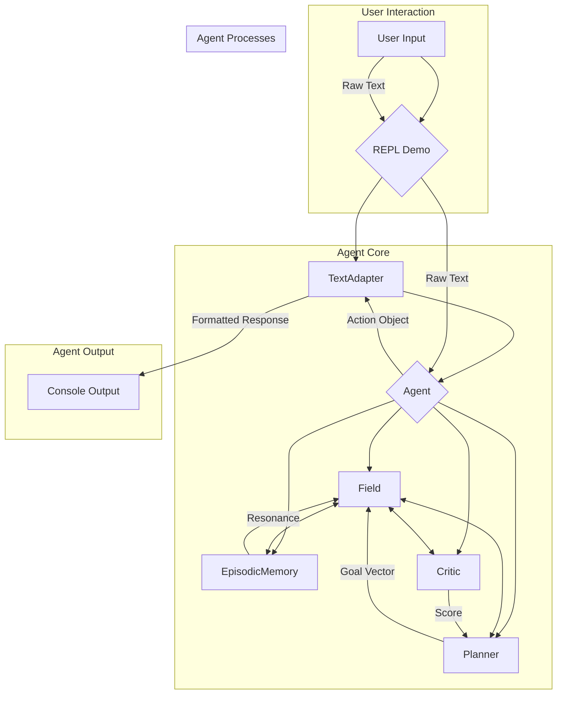

# Architecture

The system is designed around a central `Agent` that orchestrates several key components to perceive, think, and act.

## Component Descriptions

-   **REPL Demo (`demos/repl.py`)**: The main entry point for interacting with the agent. It handles user input and displays the agent's output.
-   **TextAdapter (`io/adapter.py`)**: Translates the agent's internal `Action` objects (e.g., `Action(type='positive')`) into human-readable, conversational strings (e.g., "That's great!"). It also translates external user input into a format the agent can understand.
-   **Agent (`engine/agent.py`)**: The central coordinator. It takes in percepts and orchestrates the sense-plan-act loop.
-   **Field (`engine/field.py`)**: A tensor-based data structure representing the agent's current mental state. It contains nodes with `state` and `pressure` values that evolve over time.
-   **EpisodicMemory (`engine/memory.py`)**: A long-term memory store. It saves snapshots of the `Field`'s state and retrieves them to influence the current state through resonance, allowing the agent to learn from past experiences. The memory is persisted to disk.
-   **Critic (`engine/critic.py`)**: Evaluates the `Field`'s state, primarily by calculating its entropy (standard deviation of node states). This value is used by the `Planner`.
-   **Planner (`engine/planner.py`)**: Simulates potential future actions (as `GoalNode`s) to determine which one best improves the `Field`'s state, typically by minimizing future entropy.

## Data Flow

1.  The `REPL` captures raw text from the user.
2.  The `TextAdapter` decodes the text into `Percepts`.
3.  The `Agent` receives the `Percepts` and injects them into the `Field`.
4.  The `Field` state is modified by resonance from `EpisodicMemory` and potential actions from the `Planner`.
5.  The `Agent` makes a decision, resulting in an `Action` object.
6.  The `TextAdapter` receives the `Action` object and formats it into a user-facing string.
7.  The `REPL` prints the string to the console.
