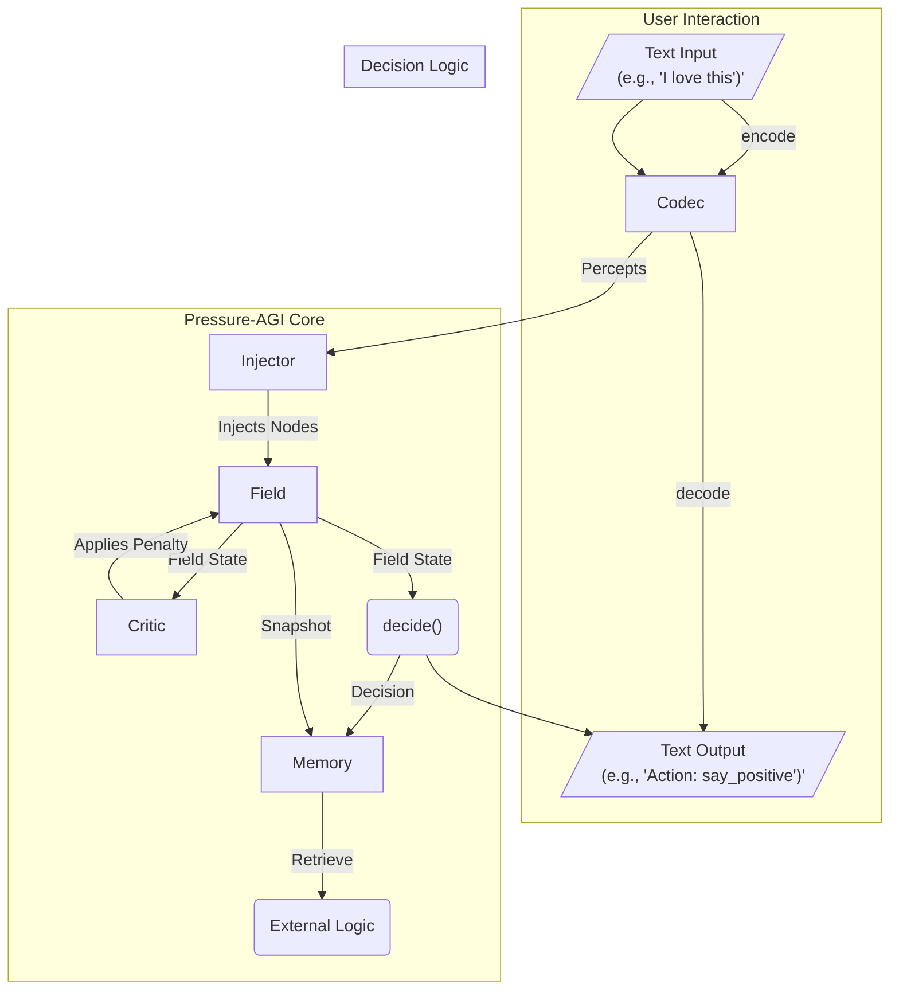

# Architecture

This document outlines the high-level architecture of the Pressure-AGI system.

```mermaid
graph TD;
    subgraph "User Interaction";
        Input[/"Text Input<br/>(e.g., 'I love this')"'/] -->|encode| Codec;
        Codec -->|decode| Output[/"Text Output<br/>(e.g., 'Action: say_positive')"'/];
    end

    subgraph "Pressure-AGI Core";
        Codec -- "Percepts" --> Injector;
        Injector -- "Injects Nodes" --> Field;
        Field -- "Field State" --> Critic;
        Critic -- "Applies Penalty" --> Field;
        Field -- "Field State" --> Decide;
        Decide -- "Decision" --> Memory;
        Field -- "Snapshot" --> Memory;
        Memory -- "Retrieve" --> Logic(External Logic);
    end

    subgraph "Decision Logic";
        Decide("decide()");
    end

    Input --> Codec;
    Decide --> Output;
``` 