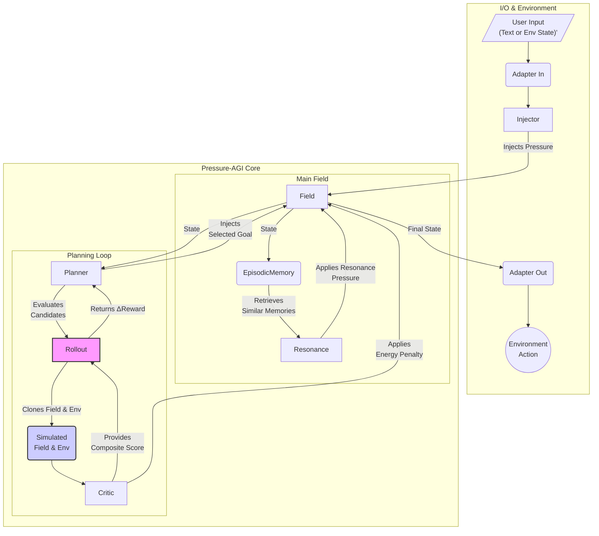

# Architecture

This document outlines the high-level architecture of the Pressure-AGI system.

The core of the system is a `Field` of nodes, representing the agent's mental state. External inputs are processed by an `Adapter` and `Injector`, which apply "pressure" to the field. The system then enters a planning loop:

1.  The `Planner` observes the `Field`'s state.
2.  It generates candidate goals and, for each one, runs a `Monte-Pressure Rollout`.
3.  The rollout simulates the future by cloning the `Field` and a model of the external `Environment`, injecting the goal, and letting the simulation `settle`.
4.  The `Critic` scores the resulting state of the simulated field using a composite score of entropy and energy. This score, combined with any reward from the simulated environment, determines the goal's value.
5.  The `Planner` selects the highest-value goal and injects its vector into the *live* `Field`.
6.  Separately, `EpisodicMemory` can induce a `Resonance` effect by retrieving similar past states and applying their pressure to the live field.
7.  The final state of the live field is passed to an `Adapter` to be converted into an action in the environment.

