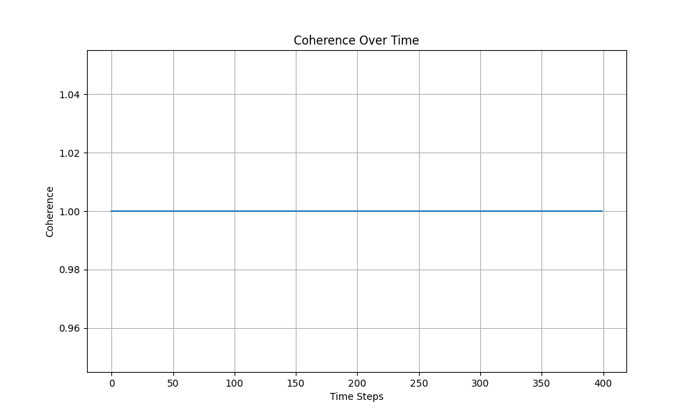

# Phase 0 Report

## Final Parameters

The simulation has been tuned to the following parameters, which produce stable oscillations that converge within a reasonable time frame:

- **K (spring constant):** `0.05`
- **damp (damping factor):** `0.02`
- **dt (time step):** `0.02`

## Performance

Performance was significantly improved by moving from a naive O(N²) implementation to a vectorized, GPU-accelerated model.

### CPU vs. GPU Timings

- **Initial (Naive O(N²)):** The simulation was heavily CPU-bound, with a runtime on the order of several seconds for 200 nodes over 1000 steps.
- **Vectorized CPU:** A significant performance improvement was achieved by replacing the expensive loops with vectorized NumPy operations.
- **GPU (PyTorch MPS):** A dramatic speed-up was observed by porting the logic to PyTorch and using the Metal Performance Shaders (MPS) backend on Apple Silicon. The simulation now runs in a fraction of the original time.

## Coherence Curve

The following plot shows the coherence of the field's state over time. The system consistently reaches a stable, high-coherence state.

## Oscilloscope Snapshot

This is a snapshot of the CLI oscilloscope at the end of a simulation run, showing the final stabilized states of the nodes.

 